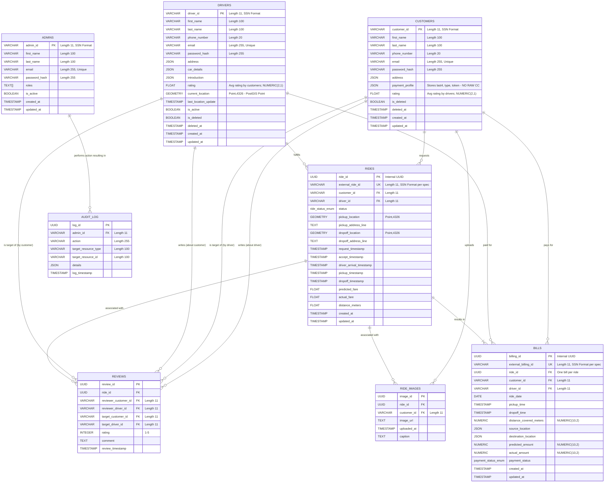

Okay, let's break this down. We'll develop the DB schema, Mermaid diagrams, and analyze middleware requirements based on the provided API documentation.

**Urgent Deliverable (EOD Monday): Middleware Field Requirements/Considerations for Driver, Billing, Admin Services**

Here's the input for Kushal and Nairui regarding specific field requirements or considerations from the Middleware perspective for the Driver, Billing, and Admin service databases:

**1. Driver Service (Drivers Table & Related)**

*   **`driverId` (PK, SSN Format `xxx-xx-xxxx`)**:
    *   **Middleware Validation:** Strict format validation (`^\d{3}-\d{2}-\d{4}$`) is crucial at the API gateway or service entry point *before* database interaction. Reject invalid formats early (400 Bad Request).
    *   **Uniqueness:** Ensure the middleware or service logic handles potential unique constraint violations gracefully (e.g., returning a 409 Conflict on POST if the `driverId` already exists).
*   **`email`**:
    *   **Middleware Validation:** Validate email format.
    *   **Uniqueness:** The DB should have a unique constraint. Middleware needs to handle potential violations (409 Conflict). Consider case-insensitivity for lookup/uniqueness (store as lowercase).
*   **`address` (Street, City, State, ZipCode)**:
    *   **Middleware Validation:**
        *   `state`: Validate against a predefined list of US states/abbreviations (case-insensitive matching recommended). Return `malformed_state` error code.
        *   `zipCode`: Validate format (`^\d{5}(-\d{4})?$`). Return `malformed_zipcode`.
    *   **DB Storage:** If storing as separate columns, validation is straightforward. If using JSON/JSONB, middleware validation is key, though DB constraints *can* sometimes be applied within JSONB. Indexing specific JSON fields (city, state, zip) is vital for search performance (`GET /drivers` query params).
*   **`carDetails` (Make, Model, Year, Color, LicensePlate)**:
    *   **Middleware Validation:** Basic type checks (year is integer). Potential format validation for `licensePlate` if required.
    *   **DB Storage:** Similar to `address`, embedding in JSONB is likely easiest unless complex car-based searching is frequent.
*   **`rating` (Float, 1.0-5.0)**:
    *   **Middleware Validation:** Ensure value is within the 1.0-5.0 range if updates are allowed via the PATCH endpoint.
    *   **Update Source:** This field is likely updated *indirectly* (e.g., by Rides/Billing service after a ride). Middleware needs to understand the flow. Will another service call `PATCH /drivers/{id}`? Or will an event (e.g., `RideRated`) trigger an update? Ensure the update mechanism is secure and reliable. The middleware might route these internal update requests/events.
*   **`currentLocation` (Latitude, Longitude, Timestamp)**:
    *   **Middleware Validation:** Validate latitude (-90 to 90) and longitude (-180 to 180) for `PATCH /location`.
    *   **Update Frequency:** This endpoint (`PATCH /drivers/{id}/location`) will be hit frequently. Middleware should be lightweight here. Consider if updates should bypass some heavier middleware steps if performance is critical.
    *   **DB Storage:** If embedded, updates are simple `UPDATE` statements. If in a separate table or geospatial store (like PostGIS or Redis Geo), middleware ensures data reaches the correct store. The timestamp should ideally be set server-side during the update to prevent client clock skew issues.
*   **`createdAt`, `updatedAt`**:
    *   **Middleware Handling:** Best handled automatically by the ORM or DB triggers (`DEFAULT NOW()`, `ON UPDATE NOW()`). Middleware should generally *not* need to manage these unless overriding timestamps is a specific requirement.
*   **Soft Deletes (Consideration)**:
    *   If implementing soft delete (`DELETE /drivers/{id}`), add an `is_deleted` (boolean, default: false) or `deleted_at` (timestamp, nullable) column.
    *   **Middleware Logic:** Middleware or service logic must automatically add `WHERE is_deleted = false` (or `WHERE deleted_at IS NULL`) to all `GET` requests (`/drivers/{id}`, `/drivers`) unless an admin flag to include deleted records is present.

**2. Billing Service (BillingInformation Table)**

*   **`billingId` (PK, SSN Format `xxx-xx-xxxx`)**:
    *   **Middleware Validation:** Strict SSN format validation.
    *   **Generation:** Is this ID provided by the client (e.g., Rides service when triggering bill creation) or generated by the Billing service itself? If generated, the API spec for `POST /bills` input should reflect this (e.g., `billingId` not in input). If client-provided, middleware must validate format and handle potential 409 Conflicts. *Using UUID is strongly recommended for generated IDs instead of SSN format.*
*   **`rideId`, `customerId`, `driverId` (FKs, SSN Format `xxx-xx-xxxx`)**:
    *   **Middleware Validation:** Strict SSN format validation for all.
    *   **Referential Integrity:** The DB should enforce FK constraints. Middleware or service logic should ideally verify the existence of these entities in their respective services *before* creating the bill to provide clearer error messages (e.g., 400 Bad Request with "Customer not found") rather than just a generic 500 from an FK violation. This might involve internal service-to-service calls coordinated by middleware or the Billing service.
*   **`date`, `pickupTime`, `dropoffTime`**:
    *   **Middleware Validation:** Validate ISO 8601 formats. Ensure `dropoffTime` >= `pickupTime`.
*   **`distanceCovered`, `predictedAmount`, `actualAmount`**:
    *   **Middleware Validation:** Ensure they are valid numbers, likely non-negative.
*   **`sourceLocation`, `destinationLocation` (Lat/Lon/AddressLine)**:
    *   **Middleware Validation:** Validate coordinates (Lat: -90 to 90, Lon: -180 to 180).
*   **`paymentStatus` (Enum: PENDING, PAID, FAILED, VOID)**:
    *   **Middleware Validation:** Ensure value is one of the allowed enum strings (case-insensitive comparison might be useful).
    *   **Update Flow:** How is this updated (e.g., from `PENDING` to `PAID`)? Likely via an internal process triggered by a payment gateway callback. Middleware might receive this callback (or an internal event) and route it to trigger an update on the Bill record (potentially via a non-public `PATCH /bills/{id}/status` or internal service logic).
*   **Deletion vs. Voiding**:
    *   If `DELETE /bills/{id}` performs a hard delete, middleware simply processes it.
    *   If deletion means setting `paymentStatus` to `VOID`, then the `DELETE` request should be translated by the middleware/service into a `PATCH` operation setting the status. Middleware might enforce rules (e.g., cannot delete/void if already `PAID` without specific permissions).

**3. Admin Service (Admin Table & Interaction Logic)**

*   **`adminId` (PK, SSN Format `xxx-xx-xxxx`)**:
    *   **Middleware Validation:** Strict SSN format validation.
*   **`email`**:
    *   **Middleware Validation:** Email format. Uniqueness constraint needed.
*   **`password_hash` (Not in API, but needed for DB)**:
    *   **Middleware Handling:** Middleware involved in login (`POST /auth/login`? - Not defined, but implied) would verify credentials against this hash. It should *never* log passwords. Password hashing should occur in the service logic before saving.
*   **`roles` (e.g., Array of strings or separate Roles table)**:
    *   **Middleware Authorization:** Crucial for *every* endpoint under `/api/v1/admin`. Middleware must:
        1.  Validate the Bearer token (Authentication).
        2.  Fetch the user associated with the token (likely from Admin or a shared Auth DB).
        3.  Check if the user's `roles` list contains the required role (e.g., 'admin', 'billing_admin') for the specific endpoint being accessed (Authorization).
        4.  Reject with 401 (Unauthorized - bad/missing token) or 403 (Forbidden - user doesn't have permission) if checks fail.
*   **Facade Endpoints (e.g., `POST /admin/drivers`)**:
    *   **Middleware Routing:** Middleware needs to route the request potentially to the underlying service's equivalent endpoint (e.g., `POST /drivers` in Driver Service). It might need to add context (e.g., an internal header `X-Requestor-Role: admin`) if the underlying service needs to apply different logic/validation for admin actions.
    *   **Middleware Authentication Propagation:** If calling other services' APIs, middleware must handle secure service-to-service authentication (e.g., passing along a service token or a delegated user token).
*   **Statistics/Charting Endpoints (`GET /admin/statistics`, `GET /admin/charts`)**:
    *   **Middleware Query Validation:** Extensive validation of query parameters (`start_date`, `end_date` formats, `area_type` enum, `chart_type` enum, etc.).
    *   **Middleware Caching:** Consider implementing caching at the middleware/gateway level for these potentially expensive endpoints, based on query parameters.
    *   **Middleware Timeouts:** Implement reasonable timeouts as data aggregation can be slow.
    *   **Data Aggregation:** While the aggregation logic is in the service, middleware ensures the request is properly formed and routed, potentially to a specialized read-replica DB or analytics service to avoid load on the primary transactional databases.

---

## Comprehensive DB Schema

Based on all API documents, here's a proposed relational schema. We'll use PostgreSQL syntax conventions (like `VARCHAR`, `TIMESTAMP WITH TIME ZONE`, `NUMERIC`, `JSONB`, `UUID`).

**Note:** While the spec asks for SSN format for many IDs, using `UUID` for system-generated IDs (`billingId`, `rideId`, potentially `reviewId`) is strongly recommended for uniqueness, security, and performance. We will use `UUID` where appropriate and `VARCHAR(11)` for IDs explicitly required to be SSN format (`driverId`, `customerId`, `adminId`).

```sql
-- Enum Types (if supported by DB, otherwise use VARCHAR with CHECK constraints)
CREATE TYPE payment_status_enum AS ENUM ('PENDING', 'PAID', 'FAILED', 'VOID');
CREATE TYPE ride_status_enum AS ENUM ('REQUESTED', 'ACCEPTED', 'DRIVER_ARRIVED', 'IN_PROGRESS', 'COMPLETED', 'CANCELLED_CUSTOMER', 'CANCELLED_DRIVER', 'NO_DRIVERS_AVAILABLE');

-- ========== Driver Service Related Tables ==========

CREATE TABLE drivers (
    driver_id VARCHAR(11) PRIMARY KEY, -- SSN Format: xxx-xx-xxxx
    first_name VARCHAR(100) NOT NULL,
    last_name VARCHAR(100) NOT NULL,
    phone_number VARCHAR(20) NOT NULL,
    email VARCHAR(255) UNIQUE NOT NULL,
    password_hash VARCHAR(255) NOT NULL, -- Needed for Authentication
    address JSONB, -- {"street": "...", "city": "...", "state": "...", "zipCode": "..."}
    car_details JSONB, -- {"make": "...", "model": "...", "year": ..., "color": "...", "licensePlate": "..."}
    introduction JSONB, -- {"imageUrl": "...", "videoUrl": "..."}
    rating NUMERIC(2, 1) DEFAULT 0.0 CHECK (rating >= 0.0 AND rating <= 5.0), -- Aggregate rating
    current_location GEOMETRY(Point, 4326), -- Using PostGIS for efficient spatial queries (Stores Lon/Lat)
    last_location_update TIMESTAMPTZ,
    is_active BOOLEAN DEFAULT TRUE, -- For driver availability status
    is_deleted BOOLEAN DEFAULT FALSE, -- For soft delete
    deleted_at TIMESTAMPTZ NULL, -- For soft delete timestamp
    created_at TIMESTAMPTZ DEFAULT NOW(),
    updated_at TIMESTAMPTZ DEFAULT NOW()
);

-- Indexing for Drivers table
CREATE INDEX idx_drivers_email ON drivers(email);
CREATE INDEX idx_drivers_address_city ON drivers USING GIN ((address -> 'city'));
CREATE INDEX idx_drivers_address_state ON drivers USING GIN ((address -> 'state'));
CREATE INDEX idx_drivers_address_zip ON drivers USING GIN ((address -> 'zipCode'));
CREATE INDEX idx_drivers_rating ON drivers(rating);
CREATE INDEX idx_drivers_current_location ON drivers USING GIST (current_location); -- Geospatial index
CREATE INDEX idx_drivers_is_active ON drivers(is_active) WHERE is_active = TRUE;
CREATE INDEX idx_drivers_is_deleted ON drivers(is_deleted) WHERE is_deleted = FALSE;


-- ========== Customer Service Related Tables ==========

CREATE TABLE customers (
    customer_id VARCHAR(11) PRIMARY KEY, -- SSN Format: xxx-xx-xxxx
    first_name VARCHAR(100) NOT NULL,
    last_name VARCHAR(100) NOT NULL,
    phone_number VARCHAR(20) NOT NULL,
    email VARCHAR(255) UNIQUE NOT NULL,
    password_hash VARCHAR(255) NOT NULL, -- Needed for Authentication
    address JSONB, -- {"street": "...", "city": "...", "state": "...", "zipCode": "..."}
    -- !! OMITTING direct CC details. Store reference to payment gateway token !!
    payment_profile JSONB, -- {"last4Digits": "...", "cardType": "...", "expiryMonth": ..., "expiryYear": ..., "paymentProcessorToken": "..."}
    rating NUMERIC(2, 1) DEFAULT 0.0 CHECK (rating >= 0.0 AND rating <= 5.0), -- Aggregate rating given BY drivers
    is_deleted BOOLEAN DEFAULT FALSE, -- For soft delete
    deleted_at TIMESTAMPTZ NULL, -- For soft delete timestamp
    created_at TIMESTAMPTZ DEFAULT NOW(),
    updated_at TIMESTAMPTZ DEFAULT NOW()
);

-- Indexing for Customers table
CREATE INDEX idx_customers_email ON customers(email);
CREATE INDEX idx_customers_address_city ON customers USING GIN ((address -> 'city'));
CREATE INDEX idx_customers_address_state ON customers USING GIN ((address -> 'state'));
CREATE INDEX idx_customers_address_zip ON customers USING GIN ((address -> 'zipCode'));
CREATE INDEX idx_customers_rating ON customers(rating);
CREATE INDEX idx_customers_is_deleted ON customers(is_deleted) WHERE is_deleted = FALSE;


-- ========== Rides Service Related Tables ==========

CREATE TABLE rides (
    ride_id UUID PRIMARY KEY DEFAULT gen_random_uuid(), -- Use UUID for internal ride ID
    external_ride_id VARCHAR(11) UNIQUE NOT NULL, -- SSN Format 'Ride ID' as required by spec for external reference
    customer_id VARCHAR(11) NOT NULL REFERENCES customers(customer_id) ON DELETE RESTRICT, -- Don't delete customer if they have rides? Or SET NULL?
    driver_id VARCHAR(11) NULL REFERENCES drivers(driver_id) ON DELETE SET NULL, -- If driver deleted, keep ride record
    status ride_status_enum NOT NULL DEFAULT 'REQUESTED',
    pickup_location GEOMETRY(Point, 4326) NOT NULL,
    pickup_address_line TEXT NULL,
    dropoff_location GEOMETRY(Point, 4326) NOT NULL,
    dropoff_address_line TEXT NULL,
    request_timestamp TIMESTAMPTZ DEFAULT NOW(),
    accept_timestamp TIMESTAMPTZ NULL,
    driver_arrival_timestamp TIMESTAMPTZ NULL, -- When driver marked arrived
    pickup_timestamp TIMESTAMPTZ NULL, -- When ride officially started
    dropoff_timestamp TIMESTAMPTZ NULL, -- When ride officially ended
    predicted_fare NUMERIC(10, 2) NULL,
    actual_fare NUMERIC(10, 2) NULL,
    distance_meters NUMERIC(10, 2) NULL, -- Store in meters for consistency
    created_at TIMESTAMPTZ DEFAULT NOW(),
    updated_at TIMESTAMPTZ DEFAULT NOW()
);

-- Indexing for Rides table
CREATE INDEX idx_rides_external_ride_id ON rides(external_ride_id);
CREATE INDEX idx_rides_customer_id ON rides(customer_id);
CREATE INDEX idx_rides_driver_id ON rides(driver_id);
CREATE INDEX idx_rides_status ON rides(status);
CREATE INDEX idx_rides_request_timestamp ON rides(request_timestamp);
-- Geospatial indexes might be useful on pickup/dropoff if searching rides by area
-- CREATE INDEX idx_rides_pickup_location ON rides USING GIST (pickup_location);


CREATE TABLE ride_images (
    image_id UUID PRIMARY KEY DEFAULT gen_random_uuid(),
    ride_id UUID NOT NULL REFERENCES rides(ride_id) ON DELETE CASCADE, -- If ride deleted, delete associated images
    customer_id VARCHAR(11) NOT NULL REFERENCES customers(customer_id) ON DELETE CASCADE, -- If customer deleted, delete their images
    image_url TEXT NOT NULL,
    uploaded_at TIMESTAMPTZ DEFAULT NOW(),
    caption TEXT NULL
);

-- Indexing for RideImages table
CREATE INDEX idx_ride_images_ride_id ON ride_images(ride_id);
CREATE INDEX idx_ride_images_customer_id ON ride_images(customer_id);


-- ========== Billing Service Related Tables ==========

CREATE TABLE bills (
    billing_id UUID PRIMARY KEY DEFAULT gen_random_uuid(), -- Use UUID internally
    external_billing_id VARCHAR(11) UNIQUE NOT NULL, -- SSN Format 'Billing ID' as required by spec
    ride_id UUID UNIQUE NOT NULL REFERENCES rides(ride_id) ON DELETE RESTRICT, -- Each ride has one bill. Don't delete ride if billed.
    customer_id VARCHAR(11) NOT NULL REFERENCES customers(customer_id) ON DELETE RESTRICT,
    driver_id VARCHAR(11) NOT NULL REFERENCES drivers(driver_id) ON DELETE RESTRICT, -- Bill needs driver context even if driver deleted later? RESTRICT might be safer.
    ride_date DATE NOT NULL,
    pickup_time TIMESTAMPTZ NOT NULL,
    dropoff_time TIMESTAMPTZ NOT NULL,
    distance_covered_meters NUMERIC(10, 2) NOT NULL,
    source_location JSONB NOT NULL, -- {"latitude": ..., "longitude": ..., "addressLine": "..."}
    destination_location JSONB NOT NULL, -- {"latitude": ..., "longitude": ..., "addressLine": "..."}
    predicted_amount NUMERIC(10, 2) NOT NULL,
    actual_amount NUMERIC(10, 2) NOT NULL,
    payment_status payment_status_enum NOT NULL DEFAULT 'PENDING',
    created_at TIMESTAMPTZ DEFAULT NOW(),
    updated_at TIMESTAMPTZ DEFAULT NOW()
);

-- Indexing for Bills table
CREATE INDEX idx_bills_external_billing_id ON bills(external_billing_id);
CREATE INDEX idx_bills_ride_id ON bills(ride_id);
CREATE INDEX idx_bills_customer_id ON bills(customer_id);
CREATE INDEX idx_bills_driver_id ON bills(driver_id);
CREATE INDEX idx_bills_payment_status ON bills(payment_status);
CREATE INDEX idx_bills_ride_date ON bills(ride_date);


-- ========== Shared/Supporting Tables ==========

CREATE TABLE reviews (
    review_id UUID PRIMARY KEY DEFAULT gen_random_uuid(),
    ride_id UUID NOT NULL REFERENCES rides(ride_id) ON DELETE CASCADE,
    reviewer_customer_id VARCHAR(11) NULL REFERENCES customers(customer_id) ON DELETE SET NULL, -- Customer reviewing Driver
    reviewer_driver_id VARCHAR(11) NULL REFERENCES drivers(driver_id) ON DELETE SET NULL, -- Driver reviewing Customer
    target_customer_id VARCHAR(11) NULL REFERENCES customers(customer_id) ON DELETE CASCADE, -- Review is about this Customer
    target_driver_id VARCHAR(11) NULL REFERENCES drivers(driver_id) ON DELETE CASCADE, -- Review is about this Driver
    rating INTEGER NOT NULL CHECK (rating >= 1 AND rating <= 5),
    comment TEXT NULL,
    review_timestamp TIMESTAMPTZ DEFAULT NOW(),
    -- Ensure one reviewer and one target is set, and they are different types
    CONSTRAINT check_review_parties CHECK (
        (reviewer_customer_id IS NOT NULL AND reviewer_driver_id IS NULL AND target_customer_id IS NULL AND target_driver_id IS NOT NULL) OR
        (reviewer_customer_id IS NULL AND reviewer_driver_id IS NOT NULL AND target_customer_id IS NOT NULL AND target_driver_id IS NULL)
    )
);

-- Indexing for Reviews table
CREATE INDEX idx_reviews_ride_id ON reviews(ride_id);
CREATE INDEX idx_reviews_target_customer_id ON reviews(target_customer_id) WHERE target_customer_id IS NOT NULL;
CREATE INDEX idx_reviews_target_driver_id ON reviews(target_driver_id) WHERE target_driver_id IS NOT NULL;


-- ========== Admin Service Related Tables ==========

CREATE TABLE admins (
    admin_id VARCHAR(11) PRIMARY KEY, -- SSN Format: xxx-xx-xxxx
    first_name VARCHAR(100) NOT NULL,
    last_name VARCHAR(100) NOT NULL,
    email VARCHAR(255) UNIQUE NOT NULL,
    password_hash VARCHAR(255) NOT NULL,
    roles TEXT[] DEFAULT ARRAY['admin']::TEXT[], -- Array of roles
    is_active BOOLEAN DEFAULT TRUE,
    created_at TIMESTAMPTZ DEFAULT NOW(),
    updated_at TIMESTAMPTZ DEFAULT NOW()
);

-- Indexing for Admins table
CREATE INDEX idx_admins_email ON admins(email);

-- Optional: Audit Log Table (Good practice for Admin actions)
CREATE TABLE audit_log (
    log_id UUID PRIMARY KEY DEFAULT gen_random_uuid(),
    admin_id VARCHAR(11) REFERENCES admins(admin_id),
    action VARCHAR(255) NOT NULL, -- e.g., 'CREATE_DRIVER', 'DELETE_CUSTOMER', 'VIEW_STATS'
    target_resource_type VARCHAR(100) NULL, -- e.g., 'Driver', 'Customer', 'Bill'
    target_resource_id VARCHAR(100) NULL, -- e.g., driver_id, customer_id, bill_id
    details JSONB NULL, -- Additional context
    log_timestamp TIMESTAMPTZ DEFAULT NOW()
);

-- Indexing for Audit Log
CREATE INDEX idx_audit_log_admin_id ON audit_log(admin_id);
CREATE INDEX idx_audit_log_timestamp ON audit_log(log_timestamp);
CREATE INDEX idx_audit_log_action ON audit_log(action);

-- Add triggers for updated_at automatically
CREATE OR REPLACE FUNCTION trigger_set_timestamp()
RETURNS TRIGGER AS $$
BEGIN
  NEW.updated_at = NOW();
  RETURN NEW;
END;
$$ LANGUAGE plpgsql;

-- Apply trigger to tables needing auto updated_at
CREATE TRIGGER set_timestamp_drivers BEFORE UPDATE ON drivers FOR EACH ROW EXECUTE PROCEDURE trigger_set_timestamp();
CREATE TRIGGER set_timestamp_customers BEFORE UPDATE ON customers FOR EACH ROW EXECUTE PROCEDURE trigger_set_timestamp();
CREATE TRIGGER set_timestamp_rides BEFORE UPDATE ON rides FOR EACH ROW EXECUTE PROCEDURE trigger_set_timestamp();
CREATE TRIGGER set_timestamp_bills BEFORE UPDATE ON bills FOR EACH ROW EXECUTE PROCEDURE trigger_set_timestamp();
CREATE TRIGGER set_timestamp_admins BEFORE UPDATE ON admins FOR EACH ROW EXECUTE PROCEDURE trigger_set_timestamp();

```

---

## Mermaid Diagram for DB Schema



---

## Middleware Requirements and Considerations

Middleware (like an API Gateway, message queue, dedicated service layer components) plays a critical role in a microservices architecture.

**Core Cross-Cutting Concerns Handled by Middleware:**

1.  **Authentication:**
    *   **Mechanism:** Verify Bearer Tokens for all incoming requests (except perhaps public endpoints like health checks).
    *   **Implementation:** Often done at the API Gateway. It validates the token signature, expiry, and potentially fetches basic user info (UserID, Roles) from an Auth Service/DB. Invalid tokens result in `401 Unauthorized`.
    *   **Flow Diagram (Auth):**
        ```mermaid
        sequenceDiagram
            participant Client
            participant APIGateway as API Gateway
            participant AuthService as Auth Service
            participant TargetService as Target Service (e.g., Driver)

            Client->>+APIGateway: Request with Bearer Token
            APIGateway->>+AuthService: Validate Token
            AuthService-->>-APIGateway: Validation Result (UserID, Roles)
            alt Token Valid
                APIGateway->>+TargetService: Forward Request (potentially with UserID/Roles headers)
                TargetService-->>-APIGateway: Response
            else Token Invalid
                APIGateway-->>Client: 401 Unauthorized
            end
            APIGateway-->>-Client: Final Response
        ```

2.  **Authorization:**
    *   **Mechanism:** Enforce access control based on roles or ownership *after* authentication.
    *   **Implementation:** Can be done at the API Gateway (for coarse-grained checks like `/admin/*` requires 'admin' role) or within the service itself (for fine-grained checks like "is the authenticated user the owner of this resource?").
    *   **Admin Service:** Middleware MUST check for 'admin' role on all `/api/v1/admin` routes.
    *   **Ownership:** For `GET /customers/{id}`, `PATCH /customers/{id}`, `DELETE /customers/{id}`, the service (or middleware if UserID is passed) must check if the authenticated `UserID` matches the `{id}` path parameter (unless the user has an admin role). Similar checks apply to Drivers and Rides.
    *   **Result:** `403 Forbidden` if authorization fails.

3.  **Input Validation:**
    *   **Mechanism:** Validate path parameters, query parameters, and request bodies against defined formats and constraints *before* hitting service logic.
    *   **Implementation:** Can be done at the Gateway using OpenAPI specs or within a validation layer in each service.
    *   **Specifics:** SSN format, email format, state codes, zip codes, coordinate ranges, enum values, required fields, numeric ranges (ratings).
    *   **Result:** `400 Bad Request` with clear error messages (using `Error Response Object`).

4.  **Rate Limiting:**
    *   **Mechanism:** Prevent abuse and ensure fair usage by limiting the number of requests a client can make in a given time window.
    *   **Implementation:** Typically done at the API Gateway based on API keys, user IDs, or IP addresses.

5.  **Request/Response Logging:**
    *   **Mechanism:** Log key details about incoming requests and outgoing responses (excluding sensitive data like passwords, full CC numbers, raw tokens).
    *   **Implementation:** Gateway or dedicated logging middleware. Essential for debugging and monitoring.

6.  **Error Handling & Standardization:**
    *   **Mechanism:** Catch errors (validation errors, service errors, unexpected exceptions) and translate them into the standard `Error Response Object` format.
    *   **Implementation:** Middleware can catch unhandled exceptions; services handle their specific business logic errors.

7.  **Data Transformation / Masking:**
    *   **Mechanism:** Modify requests or responses.
    *   **Implementation:** Middleware could potentially mask sensitive data in responses (like the `payment_profile` in Customer GET requests), although ideally, the service itself should construct responses carefully, only including non-sensitive data.

**Middleware in Specific Flows:**

1.  **Ride Completion & Billing Flow (Event-Driven):**
    *   **Trigger:** Rides Service completes a ride, updates its status to `COMPLETED`, calculates `actualFare` and `distance`.
    *   **Event Publication:** Rides Service publishes a `RideCompleted` event to a message queue (e.g., Kafka, SQS). Middleware (Message Broker) ensures delivery.
        *   *Event Payload:* Contains all necessary info for billing: `rideId` (external SSN format), `customerId`, `driverId`, `date`, `pickupTime`, `dropoffTime`, `distanceCovered`, `sourceLocation`, `destinationLocation`, `predictedAmount`, `actualAmount`.
    *   **Event Consumption:** Billing Service subscribes to the `RideCompleted` topic. A consumer component (part of Billing Service or middleware) receives the event.
    *   **Action:** The consumer validates the event data and triggers the logic equivalent to `POST /bills` within the Billing Service to create the billing record.
    *   **Diagram (Ride Completion -> Billing):**
        ```mermaid
         sequenceDiagram
             participant DriverApp
             participant RidesService as Rides Service
             participant MsgQueue as Message Queue (Kafka/SQS)
             participant BillingService as Billing Service
             participant BillingDB as Billing DB

             DriverApp->>+RidesService: End Ride Request (POST /rides/{id}/complete?)
             RidesService->>RidesService: Update Ride Status to COMPLETED, Calculate Fare/Distance
             RidesService->>+MsgQueue: Publish RideCompleted Event (Payload: ride details, fare, etc.)
             MsgQueue-->>-RidesService: Ack
             RidesService-->>-DriverApp: Ride Completed Response
             MsgQueue->>+BillingService: Deliver RideCompleted Event
             BillingService->>BillingService: Validate Event Data
             BillingService->>+BillingDB: INSERT INTO bills (...)
             BillingDB-->>-BillingService: Bill Created
             BillingService-->>-MsgQueue: Ack Event Processed
         ```

2.  **Driver Location Updates:**
    *   **Frequency:** High volume of `PATCH /drivers/{id}/location` requests.
    *   **Optimization:** Middleware should be lightweight for this path. Authentication is still needed. Validation of coordinates is essential.
    *   **Backend Store:** The request might be routed directly to a component optimized for geospatial updates (e.g., updating PostGIS or a Redis Geo set) rather than going through all layers of a standard CRUD update.

3.  **Admin Statistics/Charting:**
    *   **Complexity:** These involve complex queries, potentially across multiple services' data.
    *   **Middleware Role:** Route request, enforce admin auth, validate parameters. May route to a dedicated Reporting/Analytics Service.
    *   **Caching:** Implement caching at the gateway or reporting service level.

**Middleware Technology Choices (Examples):**

*   **API Gateway:** AWS API Gateway, Kong, Apigee, Nginx (as reverse proxy/gateway).
*   **Message Queue:** Kafka, RabbitMQ, AWS SQS, Google Pub/Sub.
*   **Service Mesh (Advanced):** Istio, Linkerd (can handle service discovery, load balancing, security, observability between services).

This provides a comprehensive schema, visualization, and a deep dive into the crucial role middleware plays in orchestrating interactions, enforcing rules, and ensuring the robustness of the microservices architecture. Remember to adapt the specific SQL and Mermaid syntax if using a different database system.