Okay team, buckle up! We have exactly two weeks (14 days) until the project deadline on **Monday, April 28th**. Today is Monday, April 14th. This plan breaks down the work based on the provided API docs, README structure, and subtask assignments. Accountability is key, and deadlines are firm.

**Project Goal:** Deliver a functional 3-tier Uber simulation demonstrating core features (Driver, Customer, Billing, Admin, Rides) with implemented APIs, database persistence, basic dynamic pricing, and necessary documentation by April 28th.

**Team & Roles (as per README):**

*   **Tier 1 (Client):** David Thach, Anne Ha
*   **Tier 2 (Middleware/Services):** Bence Danko, Cyril Goud Bhooma Goud
*   **Tier 3 (Database):** Kushal Atulbhai Adhyaru, Nairui Liu

**High-Level Plan & Milestones:**

*   **Week 1 (Apr 14 - Apr 20): FOUNDATION & CORE IMPLEMENTATION**
    *   **Goal:** Finalize schemas, set up databases/services, implement core CRUD endpoints for all services, establish basic client-service communication for key entities (Driver/Customer), implement basic authentication hooks.
    *   **Milestone (Fri, Apr 18 EOD):** DB Schemas implemented. Core CRUD API endpoints (Create, GetByID, List, Delete - basic versions) for Driver, Customer, Billing, Rides available & testable (e.g., via Postman/curl). Basic service projects set up.
*   **Week 2 (Apr 21 - Apr 27): INTEGRATION, ADVANCED FEATURES & POLISH**
    *   **Goal:** Integrate Client UI with Middleware APIs, implement advanced service logic (search filters, ride matching logic stub, stats aggregation, image handling), implement dynamic pricing logic, complete Kafka integration (if applicable/time allows), perform thorough integration testing, finalize documentation, prepare for demo.
    *   **Milestone (Thu, Apr 24 EOD):** Major features integrated (e.g., User can register, request a ride, driver can see ride, basic billing record created). Core dynamic pricing logic working. Basic Admin stats available.
    *   **Milestone (Sun, Apr 27 EOD):** All coding complete. Testing finalized. Documentation updated. Demo script prepared. System stable.
*   **Due Date (Mon, Apr 28):** Project Submission & Readiness for Presentation/Demo (May 5th/12th).

---

**Detailed Task Breakdown & Assignments:**

**Week 1: Foundation & Core Implementation (Mon, Apr 14 - Sun, Apr 20)**

*   **DATABASE (Tier 3: Kushal, Nairui)**
    *   **Task DB-1: Finalize & Document Schema (Mon, Apr 14 - Tue, Apr 15):**
        *   **Action:** Review API docs, precisely define table structures (columns, types, constraints, relationships) for Driver, Customer, Billing, Admin, Rides. Resolve any ambiguities (e.g., exact handling of CC data - store last 4/type ONLY, SSN formats).
        *   **Assignee:** Kushal (Lead), Nairui (Support/Review)
        *   **Deliverable:** Updated `/docs/database/schema.md`.
        *   **Dependency:** API Docs. Input needed from Middleware (Bence, Cyril) on any specific field requirements by Mon EOD.
    *   **Task DB-2: Setup Database Instance & Environment (Mon, Apr 14 - Tue, Apr 15):**
        *   **Action:** Set up the chosen database (MySQL/MongoDB as decided) locally and/or on a shared dev server. Configure basic access controls.
        *   **Assignee:** Nairui (Lead), Kushal (Support)
        *   **Deliverable:** Accessible database instance. Connection details shared with Tier 2. Update `/docs/development_setup.md`.
    *   **Task DB-3: Implement DB Creation Scripts (Tue, Apr 15 - Wed, Apr 16):**
        *   **Action:** Write and test SQL/NoSQL scripts to create all tables/collections based on the finalized schema. Include basic indexing for IDs.
        *   **Assignee:** Kushal (Lead), Nairui (Support/Test)
        *   **Deliverable:** Functional scripts in `/database/creation_scripts.md` or `/database/` folder. Scripts run successfully on the dev DB.
        *   **Dependency:** DB-1 (Final Schema).
    *   **Task DB-4: Initial Data Loading Script (Optional, if needed for dev) (Wed, Apr 16):**
        *   **Action:** Create script to populate basic sample data (e.g., 1-2 drivers/customers).
        *   **Assignee:** Nairui
        *   **Deliverable:** Script in `/database/`.
*   **MIDDLEWARE (Tier 2: Bence, Cyril)**
    *   **Task MW-1: Setup Service Projects & Base Framework (Mon, Apr 14 - Tue, Apr 15):**
        *   **Action:** Create separate project structures/repositories for each service (Driver, Customer, Billing, Admin, Rides). Set up basic REST framework (e.g., Express, Flask/FastAPI, Spring Boot), logging, config management. Define base URL structure (`/api/v1`).
        *   **Assignee:** Bence (Lead - e.g., Driver, Billing, Admin setup), Cyril (Lead - e.g., Customer, Rides setup). Collaborate on common elements.
        *   **Deliverable:** Runnable basic service projects. Updated `/docs/development_setup.md`.
    *   **Task MW-2: Implement Basic Authentication Hook (Tue, Apr 15 - Wed, Apr 16):**
        *   **Action:** Implement a placeholder/basic mechanism for checking `Authorization: Bearer Token`. For now, it can accept any non-empty token or a hardcoded value for development. Log the requirement. (Actual logic TBD/later). Apply to all endpoints per API docs.
        *   **Assignee:** Cyril
        *   **Deliverable:** Middleware function/decorator applied to service routes.
    *   **Task MW-3: Implement Data Access Layers (DAL) / Repositories (Wed, Apr 16 - Fri, Apr 18):**
        *   **Action:** Create functions/classes within each service to interact with the database for core CRUD operations (Create, GetById, Update, Delete, basic List). Use connection details from DB-2.
        *   **Assignee:** Bence (Driver, Billing, Admin DAL), Cyril (Customer, Rides DAL).
        *   **Deliverable:** Functional DAL code within each service project.
        *   **Dependency:** DB-3 (Creation Scripts Run), DB-2 (DB Access).
    *   **Task MW-4: Implement Core CRUD API Endpoints (Wed, Apr 16 - Sat, Apr 19):**
        *   **Action:** Implement the primary REST endpoints for each service based *exactly* on the API docs:
            *   Driver: POST /drivers, GET /drivers/{id}, PATCH /drivers/{id}, DELETE /drivers/{id}, GET /drivers (basic list)
            *   Customer: POST /customers, GET /customers/{id}, PATCH /customers/{id}, DELETE /customers/{id}, GET /customers (basic list)
            *   Billing: POST /bills, GET /bills/{id}, DELETE /bills/{id}, GET /bills (basic list)
            *   Rides: POST /rides (initial request, return REQUESTED status), GET /rides/{id}, DELETE /rides/{id}, GET /rides (basic list)
            *   Admin: POST /admin/drivers, POST /admin/customers, GET /admin/drivers/{id}, GET /admin/customers/{id}, GET /admin/bills/{id}, GET /admin/bills (basic list)
        *   **Assignee:** Bence (Driver, Billing, Admin endpoints), Cyril (Customer, Rides endpoints).
        *   **Deliverable:** Functional API endpoints testable via tools like Postman/curl. Adherence to documented request/response formats & status codes is CRITICAL. Implement basic input validation (required fields, SSN format).
        *   **Dependency:** MW-3 (DAL), MW-2 (Auth Hook).
*   **CLIENT (Tier 1: David, Anne)**
    *   **Task CL-1: Setup Client Project & Basic Structure (Mon, Apr 14 - Tue, Apr 15):**
        *   **Action:** Set up the client-side application project (e.g., React, Vue, Angular). Define basic structure for modules (Driver, Customer, Billing, Admin, Rides). Set up routing stubs.
        *   **Assignee:** David (Lead), Anne (Support).
        *   **Deliverable:** Basic runnable client project. Update `/docs/development_setup.md`.
    *   **Task CL-2: Implement Basic UI Layouts (Tue, Apr 15 - Thu, Apr 17):**
        *   **Action:** Create basic UI shells/pages for each module's main view (e.g., Driver List, Customer Profile, Request Ride Form, Admin Dashboard). Focus on structure, not final styling.
        *   **Assignee:** David (Driver, Admin UI shells), Anne (Customer, Rides, Billing UI shells).
        *   **Deliverable:** Basic navigation and page structure visible in the client app.
    *   **Task CL-3: Implement API Client / Service Call Functions (Stubs) (Wed, Apr 16 - Fri, Apr 18):**
        *   **Action:** Create functions/services within the client to make API calls. Initially, these can be stubs returning mock data or logging the intended call. Define structure for calling each Middleware service.
        *   **Assignee:** Anne (Lead), David (Support/Review).
        *   **Deliverable:** API client module/functions ready for integration.
    *   **Task CL-4: Integrate Core Create/View Operations (Fri, Apr 18 - Sun, Apr 20):**
        *   **Action:** Connect the UI for creating a new Driver and Customer to the actual Middleware APIs (POST /drivers, POST /customers). Implement displaying a single Driver/Customer profile by fetching from GET /drivers/{id}, GET /customers/{id}. Implement basic list views for Drivers/Customers using GET /drivers, GET /customers. Handle basic loading/error states.
        *   **Assignee:** David (Driver Create/View/List), Anne (Customer Create/View/List).
        *   **Deliverable:** Users can create and view basic Driver/Customer info via the UI.
        *   **Dependency:** MW-4 (Core CRUD Endpoints available and stable).

**Week 2: Integration, Advanced Features & Polish (Mon, Apr 21 - Sun, Apr 27)**

*   **DATABASE (Tier 3: Kushal, Nairui)**
    *   **Task DB-5: Implement Advanced Indexing (Mon, Apr 21 - Tue, Apr 22):**
        *   **Action:** Add necessary database indexes to support anticipated search/filter queries (e.g., index on city/state/zip for Drivers/Customers, index on status/timestamps for Rides, index on customer_id/driver_id/ride_id for Bills).
        *   **Assignee:** Kushal
        *   **Deliverable:** Updated schema/scripts with indexes. Document in `/docs/database/schema.md`.
        *   **Dependency:** Understanding of search requirements from MW-5, MW-8.
    *   **Task DB-6: Configure & Test Caching (Redis) (Tue, Apr 22 - Wed, Apr 23):**
        *   **Action:** Set up Redis instance. Implement basic caching strategy for frequently read, rarely changing data (e.g., fetching driver/customer profiles by ID). Integrate cache checks/updates into the DALs (coordinate with Tier 2).
        *   **Assignee:** Nairui (Lead), Kushal (Support)
        *   **Deliverable:** Configured Redis. Cache logic implemented for 1-2 key read paths. Document in `/docs/scalability/caching_strategy.md`.
        *   **Dependency:** MW-3 (DALs). Requires Tier 2 integration.
    *   **Task DB-7: Finalize Media Storage Strategy (Mon, Apr 21):**
        *   **Action:** Decide and document *how* image/video URLs will be stored (just URLs pointing elsewhere, or basic local storage for simulation). Configure any necessary storage locations/permissions.
        *   **Assignee:** Kushal
        *   **Deliverable:** Decision documented. Storage configured if needed.
        *   **Dependency:** Needed for CL-6, MW-6, MW-7.
*   **MIDDLEWARE (Tier 2: Bence, Cyril)**
    *   **Task MW-5: Implement Search/Filter Logic in List Endpoints (Mon, Apr 21 - Wed, Apr 23):**
        *   **Action:** Enhance the `GET /drivers`, `GET /customers`, `GET /bills`, `GET /rides` endpoints to support the documented query parameters (city, state, rating, status, dates, etc.). Update DALs as needed. Implement pagination (limit/offset).
        *   **Assignee:** Bence (Driver, Billing, Admin Search), Cyril (Customer, Rides Search).
        *   **Deliverable:** Functional search and filtering on list endpoints.
        *   **Dependency:** DB-5 (Indexes help performance).
    *   **Task MW-6: Implement Driver Location Update Endpoint (Mon, Apr 21):**
        *   **Action:** Implement `PATCH /drivers/{driver_id}/location`. Update driver's location in DB.
        *   **Assignee:** Bence
        *   **Deliverable:** Functional endpoint.
    *   **Task MW-7: Implement Image Upload Endpoint (Customer) (Tue, Apr 22):**
        *   **Action:** Implement `POST /customers/{customer_id}/rides/{ride_id}/images` to handle `multipart/form-data` image upload. Store the image (or just its URL based on DB-7) and potentially associate it with the ride (if schema supports). Return the URL. Add authorization checks.
        *   **Assignee:** Cyril
        *   **Deliverable:** Functional image upload endpoint.
        *   **Dependency:** DB-7 (Storage Strategy).
    *   **Task MW-8: Implement Rides Service Logic (Mon, Apr 21 - Thu, Apr 24):**
        *   **Action:**
            *   Implement `GET /drivers/nearby` (requires querying Driver locations). (Cyril)
            *   Implement core Ride state machine logic (stubbed): Need internal functions/endpoints (not necessarily public API) for driver `AcceptRide`, `MarkArrived`, `StartRide`, `EndRide`. These update the Ride status and timestamps. (Cyril)
            *   On `EndRide`, calculate `actualFare` (using MW-9 logic) and `distance`. Trigger billing record creation (call MW-10). (Cyril)
            *   Handle `DELETE /rides/{id}` cancellation logic (check state). (Cyril)
            *   Implement `POST /rides` to calculate `predictedFare` (using MW-9 logic) and initiate (stubbed) matching. (Cyril)
        *   **Assignee:** Cyril (Lead), Bence (Support on Fare calculation integration)
        *   **Deliverable:** Ride lifecycle can be simulated via API calls or internal triggers. `GET /rides/{id}` reflects status updates. Billing record created on completion.
        *   **Dependency:** MW-6 (Driver Location), MW-9 (Pricing), MW-10 (Billing Creation).
    *   **Task MW-9: Implement Dynamic Pricing Logic (Mon, Apr 21 - Wed, Apr 23):**
        *   **Action:** Implement the core dynamic pricing algorithm based on `/docs/pricing/algorithm_description.md`. Integrate Kaggle data as planned. Provide functions `calculatePredictedFare(pickup, dropoff, [time])` and `calculateActualFare(distance, time, [factors])`.
        *   **Assignee:** Bence
        *   **Deliverable:** Pricing functions integrated into Rides service (MW-8).
        *   **Dependency:** Algorithm design document.
    *   **Task MW-10: Implement Billing Creation Trigger (Tue, Apr 22 - Wed, Apr 23):**
        *   **Action:** Ensure the Billing Service's `POST /bills` endpoint is robust. Ensure Rides service calls this endpoint correctly upon ride completion (MW-8).
        *   **Assignee:** Bence (Billing Service), Cyril (Triggering from Rides).
        *   **Deliverable:** Billing records are created automatically when a ride completes.
        *   **Dependency:** MW-4 (Billing POST), MW-8 (Ride Completion).
    *   **Task MW-11: Implement Admin Statistics/Chart Endpoints (Tue, Apr 22 - Thu, Apr 24):**
        *   **Action:** Implement `GET /admin/statistics` and `GET /admin/charts`. This requires querying and aggregating data (likely from Billing/Rides tables). Focus on 1-2 key stats/charts first (e.g., total rides/revenue by date, rides per area).
        *   **Assignee:** Bence
        *   **Deliverable:** Functional endpoints returning aggregated data in the specified formats.
        *   **Dependency:** DB-5 (Indexes critical), Data availability in DB.
    *   **Task MW-12: Kafka Integration (Optional - Time Permitting) (Wed, Apr 23 - Fri, Apr 25):**
        *   **Action:** Implement basic Kafka producer in Rides service for `RideCompleted` event. Implement basic consumer in Billing service (alternative to direct POST call in MW-10) or another relevant service.
        *   **Assignee:** Cyril (Producer), Bence (Consumer).
        *   **Deliverable:** Basic event flow demonstrable. Update docs.
*   **CLIENT (Tier 1: David, Anne)**
    *   **Task CL-5: Implement Full CRUD UI for Driver/Customer (Mon, Apr 21 - Tue, Apr 22):**
        *   **Action:** Implement UI for updating (PATCH) and deleting (DELETE) Drivers and Customers. Implement client-side input validation based on API docs.
        *   **Assignee:** David (Driver Update/Delete/Validation), Anne (Customer Update/Delete/Validation).
        *   **Deliverable:** Full CRUD operations available from the UI for Driver/Customer.
        *   **Dependency:** MW-4 (PATCH/DELETE Endpoints).
    *   **Task CL-6: Implement Image/Video Upload UI (Tue, Apr 22 - Wed, Apr 23):**
        *   **Action:** Implement form/button for Driver Intro upload (connects to relevant PATCH /drivers/{id} field). Implement form/button for Customer Ride Image upload (connects to POST /customers/.../images).
        *   **Assignee:** David (Driver Intro), Anne (Customer Ride Image).
        *   **Deliverable:** UI allows users to select and attempt uploads.
        *   **Dependency:** MW-7 (Image Upload Endpoint), DB-7 (Storage), Potentially MW-4 (Driver PATCH update).
    *   **Task CL-7: Implement Ride Request & Tracking UI (Tue, Apr 22 - Thu, Apr 24):**
        *   **Action:** Implement UI form for `POST /rides`. Display `predictedFare`. Poll `GET /rides/{id}` to show ride status updates (REQUESTED -> ACCEPTED -> ... -> COMPLETED/CANCELLED). Display basic map with pickup/dropoff (static for now is okay). Implement Cancel button (DELETE /rides/{id}). Show nearby drivers (using GET /drivers/nearby).
        *   **Assignee:** Anne
        *   **Deliverable:** User can request a ride, see basic status updates, and cancel. Nearby drivers shown (basic).
        *   **Dependency:** MW-4 (Rides CRUD), MW-8 (Rides Logic, Nearby Drivers), MW-9 (Pricing for prediction).
    *   **Task CL-8: Implement Billing History UI (Wed, Apr 23):**
        *   **Action:** Implement a simple view to list bills for the logged-in user (GET /bills?customer_id=...). Show key details (Date, Fare, Status).
        *   **Assignee:** Anne
        *   **Deliverable:** Customer can see their ride/billing history.
        *   **Dependency:** MW-5 (Billing Search/Filter). Assumes basic user context is available.
    *   **Task CL-9: Implement Admin Module UI (Wed, Apr 23 - Fri, Apr 25):**
        *   **Action:** Implement UI for Admin functions: Add Driver/Customer (reuse forms if possible), Review Driver/Customer accounts (display details), Search/Display Bills, View Statistics/Charts (display data from MW-11).
        *   **Assignee:** David
        *   **Deliverable:** Admin user can perform core administrative tasks via the UI.
        *   **Dependency:** MW-4, MW-5, MW-11 (Admin Endpoints).
    *   **Task CL-10: Refine UI/UX & Error Handling (Thu, Apr 24 - Sat, Apr 26):**
        *   **Action:** Improve visual consistency. Ensure user-friendly error messages are displayed for API errors or validation failures across all modules.
        *   **Assignee:** David, Anne
        *   **Deliverable:** Polished and more robust UI.
*   **ALL TIERS**
    *   **Task ALL-1: Unit Testing (Ongoing, Dedicated Push: Tue, Apr 22 - Thu, Apr 24):**
        *   **Action:** Write unit tests for complex logic (DAL methods, service logic, utility functions, client components/validation). Aim for reasonable coverage of critical paths.
        *   **Assignee:** All team members for their respective code.
        *   **Deliverable:** Unit tests checked into repo. `/docs/testing/test_plan.md` updated.
    *   **Task ALL-2: Integration Testing (Mon, Apr 21 - Sat, Apr 26):**
        *   **Action:** Test end-to-end flows: Client -> Middleware -> Database.
            *   Tier 1-2: David/Anne test Client interactions with Bence/Cyril's APIs.
            *   Tier 2-3: Bence/Cyril test Service interactions with Kushal/Nairui's DB.
            *   Focus on core flows: Register User, Request Ride, Complete Ride, Generate Bill, Admin View Stats.
        *   **Assignee:** Cross-tier pairs (e.g., David+Bence, Anne+Cyril, Bence+Kushal, Cyril+Nairui).
        *   **Deliverable:** Documented integration test results in `/docs/testing/test_results.md`. Bugs filed and fixed.
    *   **Task ALL-3: Documentation Finalization (Fri, Apr 25 - Sun, Apr 27):**
        *   **Action:** Review and update ALL documentation in `/docs/`: API docs (if changed), Schema, Architecture, Setup, Testing, README (contribution log!). Ensure consistency and completeness.
        *   **Assignee:** All team members responsible for docs related to their work. Anne (Lead overall review).
        *   **Deliverable:** Finalized documentation suite.
    *   **Task ALL-4: Deployment Prep (Simulated) (Fri, Apr 25):**
        *   **Action:** Ensure all services and the client can be built and run consistently using scripts/instructions in `development_setup.md`. Prepare simple run scripts. (No complex deployment needed unless required).
        *   **Assignee:** Bence (Middleware), David (Client), Kushal (DB).
        *   **Deliverable:** Clear, tested instructions to run the entire simulation.
    *   **Task ALL-5: Demo Preparation (Sat, Apr 26 - Sun, Apr 27):**
        *   **Action:** Define key demo scenarios. Prepare demo script. Ensure system is stable and data is ready for demo flows. Practice the demo.
        *   **Assignee:** All team members. Cyril (Lead Demo Script).
        *   **Deliverable:** Demo script. Stable system ready for presentation.

---

**Dependencies Diagram (Mermaid JS):**

```mermaid
graph TD
    %% Week 1 Nodes
    subgraph Week_1 ["Week 1 (Apr 14 - Apr 20)"]
        %% Tier 3 DB
        DB1[DB-1: Finalize Schema];
        DB2[DB-2: Setup DB Instance];
        DB3[DB-3: Implement Creation Scripts];
        DB4[DB-4: Initial Data Script];

        %% Tier 2 MW
        MW1[MW-1: Setup Service Projects];
        MW2[MW-2: Basic Auth Hook];
        MW3[MW-3: Implement DALs];
        MW4[MW-4: Implement Core CRUD APIs];

        %% Tier 1 Client
        CL1[CL-1: Setup Client Project];
        CL2[CL-2: Basic UI Layouts];
        CL3[CL-3: API Client Stubs];
        CL4[CL-4: Integrate Core Create/View];

        %% Week 1 Dependencies
        DB1 --> DB3;
        DB2 --> DB3;
        DB3 --> MW3;
        DB2 --> MW3; 
        MW1 --> MW3;
        MW1 --> MW4;
        MW2 --> MW4;
        MW3 --> MW4;
        MW4 --> CL4;
        CL1 --> CL2;
        CL1 --> CL3;
        CL2 --> CL4;
        CL3 --> CL4;
    end

    %% Week 2 Nodes
    subgraph Week_2 ["Week 2 Apr 21 - Apr 27"]
        %% Tier 3 DB
        DB5[DB-5: Advanced Indexing];
        DB6[DB-6: Caching Redis];
        DB7[DB-7: Media Storage Strategy];

        %% Tier 2 MW
        MW5[MW-5: Implement Search/Filter];
        MW6[MW-6: Driver Location Update EP];
        MW7[MW-7: Image Upload EP];
        MW8[MW-8: Rides Service Logic];
        MW9[MW-9: Dynamic Pricing Logic];
        MW10[MW-10: Billing Creation Trigger];
        MW11[MW-11: Admin Stats/Chart EPs];
        MW12[MW-12: Kafka Integration Opt];

        %% Tier 1 Client
        CL5[CL-5: Full CRUD UI Driver/Cust];
        CL6[CL-6: Image/Video Upload UI];
        CL7[CL-7: Ride Request/Tracking UI];
        CL8[CL-8: Billing History UI];
        CL9[CL-9: Admin Module UI];
        CL10[CL-10: Refine UI/UX];

        %% Cross-Cutting
        ALL1[ALL-1: Unit Testing];
        ALL2[ALL-2: Integration Testing];
        ALL3[ALL-3: Documentation Finalization];
        ALL4[ALL-4: Deployment Prep];
        ALL5[ALL-5: Demo Preparation];

        %% Week 2 Dependencies
        %% DB Dependencies
        DB1 --> DB5; 

        DB7 --> MW7;
        DB7 --> CL6;
        MW3 --> DB6;

        %% MW Dependencies
        MW4 --> MW5; 
        MW4 --> MW6;
        MW4 --> MW7;
        MW4 --> MW8;
        MW4 --> MW10;
        MW4 --> MW11;
        MW5 --> MW11;
        MW6 --> MW8; 
        MW9 --> MW8; 
        MW10 --> MW8; 
        MW8 --> MW10; 
        MW8 --> CL7; 
        MW5 --> CL8;
        MW5 --> CL9; 
        MW7 --> CL6; 
        MW11 --> CL9;
        MW8 --> MW12;
        MW10 --> MW12;

        %% Client Dependencies
        CL4 --> CL5;
        CL5 --> CL10;
        CL6 --> CL10;
        CL7 --> CL10;
        CL8 --> CL10;
        CL9 --> CL10;

        %% Testing/Doc Dependencies
        MW4 --> ALL1; CL4 --> ALL1; MW8 --> ALL1; MW9 --> ALL1; 
        CL4 --> ALL2; MW4 --> ALL2; DB3 --> ALL2; 
        CL7 --> ALL2; MW8 --> ALL2; MW10 --> ALL2; 
        ALL1 --> ALL2; 
        ALL2 --> ALL5; 
        ALL2 --> ALL3;
        ALL4 --> ALL5; 
    end

    %% Link Weeks
    Week_1 --> Week_2;
    

```

---

**Communication & Coordination:**

1.  **Daily Stand-ups (Mandatory):** 15 minutes every morning (e.g., 9 AM PST). What did you do yesterday? What will you do today? Any blockers?
2.  **Slack Channel:** Use for immediate questions, updates, and sharing information (e.g., endpoint is ready, DB schema updated). Create specific threads for Tier1/Tier2/Tier3 discussions if needed.
3.  **Code Reviews:** Use GitHub Pull Requests. At least one other team member (preferably from the same tier or interfacing tier) must review before merging critical code.
4.  **Task Board:** Use a shared tool (GitHub Projects, Trello, Jira) to track task status visually. Update daily.
5.  **Blocker Escalation:** If you are blocked for more than 2-3 hours, immediately notify the person/team blocking you AND the whole team channel. Don't wait for the stand-up.

**Accountability:**

*   Assignments are clear. If you are assigned a task, you are responsible for its completion by the deadline or communicating blockers ASAP.
*   "Lead" assignees are responsible for coordinating the effort on that task, but collaborators share the responsibility.
*   Git commits *must* be descriptive (`[Service/Module/Tier]: Short Description`).
*   Update your weekly contribution log in the README as specified.
*   Active participation in stand-ups and communication channels is expected.

This is an aggressive schedule. Focus, clear communication, and helping each other are critical. Let's get started!